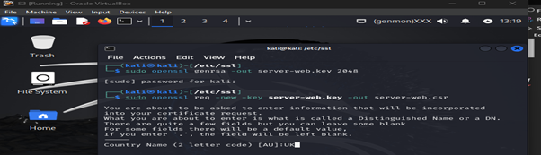
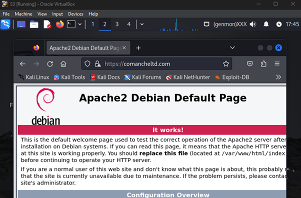

# S3: HTTPS Server Configuration

## Objective
Configure S3 as a secure HTTPS server with a self-signed SSL/TLS certificate, enforcing HTTPS-only access and basic authentication.

## Technologies
- Apache2, OpenSSL, SSL/TLS, Linux (Ubuntu)
- Tools: `openssl`, `apache2`, `.htaccess`

## Setup Steps
1. Assigned static IP (192.168.1.40) to S3 using network configuration.
2. Installed Apache2: `sudo apt install -y apache2`.
3. Created a secure directory: `/var/www/html/secure`.
4. Generated a self-signed SSL/TLS certificate using `openssl`.
5. Configured Apache2 with SSL/TLS and basic authentication via `.htaccess`.
6. Enabled the SSL module and restarted Apache2.
7. Tested HTTPS access and authentication.

## Results
- S3 served content over HTTPS with a self-signed certificate.
- Access was restricted to authenticated users only.

## Files
- `scripts/setup-https.sh`: Installs Apache2 and creates secure directory.
- `scripts/configure-ssl.sh`: Generates SSL certificate and configures Apache.
- `configs/apache2.conf`: Apache configuration file.
- `images/*`: Screenshots of setup and testing.

## Screenshots
- Static IP Configuration: 
- Apache Installation: 
- SSL Generation: 
- CSR Configuration: 
- Apache test: 
- HTTPS Test: 
- Authentication Test: 
- Apache verify: .
