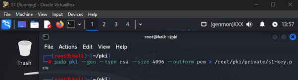

# S4: S1–S4 IPsec VPN

## Objective
Deploy a security mechanism to permanently secure IP payloads between S1 and S4, a new server.

## Technologies
- IPsec, StrongSwan, Linux (Ubuntu)
- Tools: `strongswan`, `strongswan-pki`

## Setup Steps
1. Assigned static IP for S4 (e.g., 192.168.1.50).
2. Installed StrongSwan on S1 and S4: `sudo apt install strongswan strongswan-pki libcharon-extra-plugins libcharon-extraauth-plugins libstrongswan-extra-plugins libtss2-tcti-tpm2-dev`.
3. Created directory `/root/pki/private/` for private keys.
4. Generated RSA keys for S1 and S4: `sudo pki --gen --type rsa --size 2048 --outform pem > /root/pki/private/s1_key.pem`.
5. Created CA key and certificate: `sudo pki --gen --type rsa --size 4096 --outform pem > /root/pki/private/ca-key.pem` and `sudo pki --self --ca --lifetime 3650 --in /root/pki/private/ca-key.pem --type rsa --dn "CN=VPN root CA" --outform pem > /root/pki/cacerts/ca-cert.pem`.
6. Generated server private key and CSR, signed with CA, and copied to `/etc/ipsec.d/`.
7. Configured `/etc/sysctl.conf` for IP forwarding and applied with `sudo sysctl -p`.
8. Configured `ipsec.conf` on S1 and S4 for IKEv2 tunnel.
9. Tested VPN with `ipsec statusall` and verified traffic with `sudo tcpdump -i eth0 port 500 or port 4500`.

## Results
- Secure IPsec VPN tunnel established between S1 and S4.
- Encrypted payloads verified.

## Files
- `scripts/setup-vpn.sh`: Installs StrongSwan and sets up VPN.
- `configs/ipsec.conf`: IPsec configuration file.
- `configs/sysctl.conf`: System control configuration for IP forwarding.
- `images/*`: Screenshots of setup and testing.

## Screenshots
- StrongSwan Install: 
- Key Generation: 
- CA Certificate: 
- IPsec Config: 
- Sysctl Config: 
- VPN Status: 
- copy cert to directory: 
- private key gen: 
- moving doc: 
-  Test vpn: 
-  Test vpn: 
- config ipsec: 
- config ipsec: 
- status vpn: 
